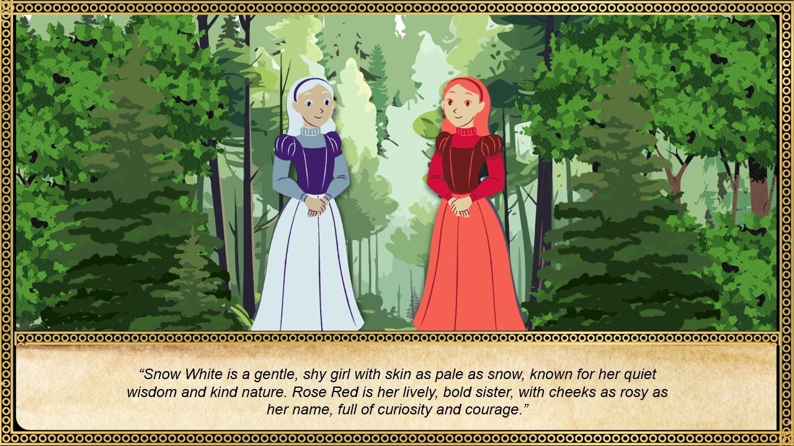

# Magic in Motion: Interactive Fairy Tales

## Overview
"Magic in Motion" is an interactive storytelling project that brings the magic of fairy tales to life! Developed as a team of three during the **ACM-W Hackathon**, this project allows users to step into the world of fairy tales, starting with the classic story **"Snow White and Rose Red."** 

The project was awarded the **"Cutest Hack"** for its engaging approach to interactive storytelling.

## Features:
- **Interactive Storytelling**: Users can navigate through scenes and read along with the dialogues.
- **Smooth Transition Effects**: Scene images fade in smoothly to give a cinematic experience.
- **Choice of Stories**: While focused on "Snow White and Rose Red" for the scope of the Hackathon, the platform is designed to expand to additional stories.
- **User-friendly Interface**: Simple navigation through previous and next buttons to explore the story at your own pace.

## Technologies Used:
- **HTML** for structure
- **CSS** for styling and animations
- **JavaScript** for interactivity and dynamic content management

## How to Use:
1. Click the "Start" button to begin the interactive experience.
2. Choose the "Snow White and Rose Red" story to start your fairy tale journey.
3. Use the navigation buttons to move between scenes.
4. Return to the home page anytime using the "Home" button.
